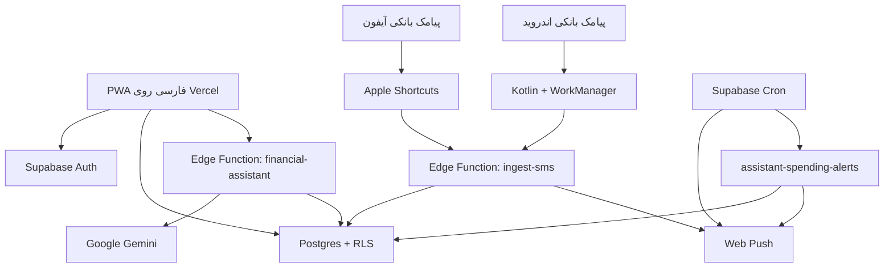

# دارایی‌بان

<p align="center">
  
</p>

<p align="center">
  
  
  
  
  
  
  
  
</p>

<p align="center">
  <a href="https://selfmali.vercel.app">نسخه زنده</a> ·
  <a href="./docs/FINANCIAL_ASSISTANT.md">دستیار هوش مصنوعی</a> ·
  <a href="#راه‌اندازی-محلی">راه‌اندازی</a> ·
  <a href="./docs/ARCHITECTURE.md">معماری</a> ·
  <a href="#اتصال-iphone-shortcuts">اتوماسیون آیفون</a> ·
  <a href="./SECURITY.md">امنیت</a>
</p>

یک اپ مالی فارسی و چندکاربره برای ثبت و تحلیل تراکنش‌ها، بودجه، بدهی‌ها، طلب‌ها و دارایی‌ها. دارایی‌بان به‌صورت PWA و اپ اندروید ارائه می‌شود؛ پیامک بانکی در آیفون از طریق Shortcuts و در اندروید مستقیماً داخل خود برنامه به تراکنش تبدیل می‌شود.

دستیار هوش مصنوعی دارایی‌بان با **Google Gemini** به داده‌های مالی همان کاربر متصل است و برای تحلیل هزینه‌ها و برنامه‌ریزی مالی کمک می‌کند. کاربر می‌تواند در گفتگو، برچسب‌گذاری و ویرایش اطلاعات، ساخت بودجه یا هشدار عبور از سقف هزینه را درخواست کند.

> رابط کاربری کاملاً راست‌چین است، مبالغ را به تومان نمایش می‌دهد و تاریخ‌ها را با تقویم شمسی نشان می‌دهد.

## امکانات اصلی

- دستیار هوش مصنوعی Google Gemini با دسترسی به داده‌های همان کاربر، ویرایش و برچسب‌گذاری قابل بازگردانی، ساخت بودجه و هشدار هزینه
- ثبت‌نام و ورود با ایمیل/رمز و Google OAuth
- نگهداری نشست کاربر روی دستگاه و جداسازی داده‌ها با Row Level Security
- ثبت دستی تراکنش و دریافت خودکار پیامک بانکی از iPhone Shortcuts یا اپ بومی Android
- فعال‌سازی یک‌مرحله‌ای پیامک اندروید، بدون MacroDroid یا برنامه جانبی
- صف آفلاین و ارسال خودکار پیامک بانکی پس از برگشت اینترنت
- استخراج «مانده» پیامک و نمایش آخرین موجودی هر بانک و حساب به تومان
- اعلان PWA برای عبور از سقف هزینه روزانه و گزارش روزانه در ساعت انتخابی
- ویرایش تراکنش، برچسب‌گذاری، انتقال به سطل زباله، بازیابی و حذف دائمی
- بودجه‌بندی مبتنی بر برچسب تراکنش؛ برای نمونه بودجه «اسنپ» فقط تراکنش‌های دارای تگ `اسنپ` را محاسبه می‌کند
- تقویم مالی شمسی و گزارش روزانه
- ثبت بدهی، طلب، دارایی و هدف ترکیب دارایی
- حالت روشن و تاریک
- نصب به‌صورت PWA روی iOS و Android
- طراحی واکنش‌گرا برای موبایل و دسکتاپ

## دستیار هوش مصنوعی مالی

در نسخه وب، پس از ورود از منوی **دستیار مالی** گفتگو را شروع کنید. دستیار از تراکنش‌ها، دارایی‌ها، موجودی بانک‌ها، بودجه‌ها، بدهی‌ها و طلب‌های حساب شما استفاده می‌کند. جمع هزینه و درآمد در دیتابیس محاسبه می‌شود تا به تعداد ردیف‌های نمایش‌داده‌شده در داشبورد محدود نباشد.

| نمونه درخواست | قابلیت دستیار |
|---|---|
| «هزینه‌های این ماه من بیشتر مربوط به کدام دسته است؟» | تحلیل تراکنش‌های ثبت‌شده و کمک به برنامه‌ریزی هزینه |
| «به تراکنش‌های تاکسی برچسب رفت‌وآمد اضافه کن» | خواندن و برچسب‌گذاری گروهی با حفظ برچسب‌های قبلی |
| «برای رفت‌وآمد این ماه یک بودجه دو میلیون تومانی بساز» | ساخت بودجه پس از مشخص‌شدن بازه و برچسب مربوط |
| «اگر هزینه امروز از یک میلیون تومان بیشتر شد، خبرم کن» | ذخیره هشدار و بررسی زمان‌بندی‌شده، حتی پس از بستن گفتگو |

تغییرات دستیار در گفتگو گزارش می‌شوند و امکان بازگردانی دارند. اگر اطلاعات یک تراکنش مبهم باشد، دستیار باید از کاربر توضیح بخواهد. گفتگوها ذخیره می‌شوند و هر کاربر فقط به اطلاعات خودش دسترسی دارد.

اتصال مدل از طریق API مستقیم Gemini و Supabase Edge Functions انجام می‌شود. کلید در Supabase Vault رمزگذاری شده و به مرورگر یا APK فرستاده نمی‌شود. متن گفتگو و داده مالی مورد نیاز برای پاسخ به Google ارسال می‌شود. هشدارها به Web Push موجود برنامه و مجوز اعلان دستگاه وابسته‌اند؛ این قابلیت اعلان پس‌زمینه بومی Android اضافه نمی‌کند.

جزئیات مدل، راه‌اندازی روی محیط شخصی، محدودیت‌ها و آزمون‌ها در [راهنمای دستیار مالی](docs/FINANCIAL_ASSISTANT.md) آمده است.

## معماری



- **Frontend:** Next.js 16، React 19، TypeScript و CSS اختصاصی
- **Backend:** Supabase Auth و Postgres
- **AI Assistant:** Google Gemini، AI SDK و ابزارهای مالی با دسترسی محدود به حساب کاربر
- **Automation:** Supabase Edge Function برای تحلیل پیامک، موجودی بانک و هشدار سقف هزینه
- **Notifications:** Web Push استاندارد با VAPID و Supabase Cron برای گزارش روزانه
- **Hosting:** Vercel با استقرار خودکار شاخه `main`
- **PWA:** Web App Manifest، Service Worker و آیکن‌های نصب
- **Android:** Capacitor 8، Kotlin، Android Keystore و WorkManager

شرح جزئی‌تر جریان داده، امنیت و اجزای پروژه در [مستند معماری](docs/ARCHITECTURE.md) آمده است.

## ساختار پروژه

```text
app/                         رابط کاربری، احراز هویت و منطق مالی
android/                     پروژه بومی اندروید، دریافت پیامک و صف آفلاین
lib/supabase.ts              کلاینت Supabase و آدرس endpoint پیامک
lib/android-sms.ts           پل TypeScript به قابلیت بومی پیامک اندروید
public/                      manifest، service worker، آیکن‌ها و تصویر اشتراک‌گذاری
supabase/functions/ingest-sms تحلیل پیامک بانکی و ثبت امن تراکنش
supabase/functions/send-daily-summary ارسال زمان‌بندی‌شده گزارش هزینه روز
supabase/functions/financial-assistant گفتگو با Gemini، ابزارهای مالی و بازگردانی تغییرات
supabase/functions/assistant-spending-alerts بررسی مستقل هشدارهای ساخته‌شده در گفتگو
supabase/functions/_shared/push.ts ارسال امن Web Push و پاک‌سازی اشتراک منقضی
supabase/migrations/         تاریخچه تغییرات دیتابیس و RLS
docs/                        مستندات معماری و راه‌اندازی
docs/FINANCIAL_ASSISTANT.md  راهنمای دستیار، تنظیم کلید و محدودیت‌های اعلان
scripts/verify-gemini.mjs    آزمون اختیاری مدل واقعی با داده ساختگی
.github/workflows/ci.yml     بررسی خودکار lint و build
.github/workflows/android.yml ساخت و بررسی APK آزمایشی اندروید
vercel.json                  تنظیمات استقرار Vercel
```

## راه‌اندازی محلی

پیش‌نیازها:

- Node.js نسخه 22 یا جدیدتر
- یک پروژه Supabase با migrationها و Edge Function این مخزن

سپس:

```bash
git clone https://github.com/arschia/darayiban.git
cd darayiban
npm ci
cp .env.example .env.local
npm run dev:vercel
```

مقادیر واقعی زیر را در `.env.local` قرار دهید:

```dotenv
NEXT_PUBLIC_SUPABASE_URL=https://YOUR_PROJECT.supabase.co
NEXT_PUBLIC_SUPABASE_PUBLISHABLE_KEY=sb_publishable_YOUR_KEY
NEXT_PUBLIC_SITE_URL=http://localhost:3000
```

`NEXT_PUBLIC_SUPABASE_PUBLISHABLE_KEY` کلید عمومی سمت مرورگر است. کلید `service_role` فقط داخل محیط امن Supabase Edge Functions قرار می‌گیرد و هرگز نباید در کد، GitHub یا متغیر `NEXT_PUBLIC_` ذخیره شود.

## فرمان‌های کاربردی

| فرمان | کاربرد |
|---|---|
| `npm run dev:vercel` | اجرای محلی با Next.js |
| `npm run build:vercel` | ساخت نسخه production برای Vercel |
| `npm run android:sync` | ساخت رابط وب و همگام‌سازی پروژه Android |
| `npm run android:open` | بازکردن پروژه در Android Studio |
| `npm run start:vercel` | اجرای build تولیدشده |
| `npm run lint` | بررسی کیفیت کد |
| `npm run typecheck` | بررسی کامل TypeScript |
| `npm run test:assistant` | آزمون دستیار، جداسازی داده کاربران، ویرایش و هشدارها |
| `npm test` | اجرای lint، typecheck، آزمون‌های دستیار و build کامل |
| `npm run dev` | اجرای نسخه سازگار با OpenAI Sites/Vinext |
| `npm run build` | ساخت نسخه OpenAI Sites/Vinext |

## اتصال iPhone Shortcuts

در اپ، از بخش «آموزش» یک توکن اختصاصی بسازید. سپس در Automation آیفون، رویداد دریافت پیام را انتخاب و اکشن **Get Contents of URL** را با مشخصات زیر تنظیم کنید:

```text
POST https://YOUR_PROJECT.supabase.co/functions/v1/ingest-sms
```

Header:

```text
x-selfmali-token: توکن اختصاصی حساب
```

JSON Body:

```json
{
  "message": "متن کامل پیامک",
  "device_time": "زمان دریافت پیام روی آیفون",
  "bank_name": "نام بانک (اختیاری)"
}
```

توکن هر کاربر به‌صورت هش‌شده در دیتابیس نگهداری می‌شود. Edge Function پیام‌های تکراری را با fingerprint تشخیص می‌دهد، پیام غیرمالی را وارد جدول تراکنش نمی‌کند و اگر پیام شامل «مانده» یا «موجودی» باشد آخرین موجودی همان بانک و حساب را به‌روز می‌کند.

## اپ اندروید

اصلاح ثبت خودکار پیامک در [نسخه ۱.۱.۱](https://github.com/arschia/darayiban/releases/tag/android-v1.1.1) منتشر شده است. [راهنمای تغییرات و نصب](docs/ANDROID_1.1.1.md) را ببینید. فایل لینک گوگل‌درایو باید توسط مالک با APK تازه جایگزین شود.

اپ اندروید همان رابط React/TypeScript نسخه PWA را با Capacitor اجرا می‌کند و فقط قابلیت‌های سیستمی با Kotlin نوشته شده‌اند. کاربر پس از ورود، از بخش «آموزش» روی «فعال‌کردن ثبت خودکار» می‌زند و یک‌بار اجازه دریافت پیامک را تأیید می‌کند.

نسخه آزمایشی ۱.۱.۰ همراه دستیار مالی Gemini از بخش «نصب برنامه» یا [لینک دانلود اندروید](https://drive.google.com/file/d/1hGgnOKkdoNPL3E4wzQtKaST30BMjc9xX/view?usp=drive_link) قابل دریافت است. با همان حساب وب وارد شوید و منوی «دستیار مالی» را باز کنید. [راهنمای نصب و تغییرات نسخه](docs/ANDROID_1.1.0.md) محدودیت اعلان پس‌زمینه و نصب روی نسخه قبلی را توضیح می‌دهد.

- `BroadcastReceiver` پیامک تازه را از API رسمی Android دریافت می‌کند.
- پیامک‌های رمز پویا و کد ورود کنار گذاشته می‌شوند و فقط الگوهای تراکنش بانکی وارد صف می‌شوند.
- WorkManager در نبود اینترنت پیام را نگه می‌دارد و با backoff نمایی دوباره ارسال می‌کند.
- توکن خام در دیتابیس ذخیره نمی‌شود و نسخه روی گوشی با AES/GCM و کلید غیرقابل‌استخراج Android Keystore رمزگذاری می‌شود.
- حداقل نسخه پشتیبانی‌شده Android 7 (API 24) است و پیاده‌سازی به برند یا رابط سازنده خاصی وابسته نیست.

برای ساخت محلی، Android Studio، JDK 21 و SDK 36 را نصب و سپس این فرمان‌ها را اجرا کنید:

```bash
npm ci
npm run android:sync
npm run android:open
```

Workflow با نام **Android APK** پس از هر تغییر مرتبط، APK آزمایشی می‌سازد و امضا و وجود دستیار داخل فایل نصب را بررسی می‌کند. پس از موفقیت ساخت روی `main`، نسخه جدید در GitHub Releases منتشر می‌شود. فایل نصب قدیمی وارد بسته اپ نمی‌شود. نسخه پایدار باید با keystore خصوصی و ثابت امضا شود؛ فایل keystore نباید وارد مخزن شود.

## اعلان‌های PWA

کاربر از بخش «اعلان‌ها» ابتدا دریافت اعلان را روی همان دستگاه فعال می‌کند و سپس می‌تواند سقف هزینه روزانه و ساعت گزارش را تعیین کند. در iOS، وب‌اپ باید ابتدا به Home Screen اضافه و از آیکن نصب‌شده باز شود.

- هشدار سقف هزینه بعد از ثبت برداشت پیامکی و فقط یک‌بار در هر روز ارسال می‌شود.
- گزارش روزانه با Supabase Cron و Edge Function `send-daily-summary` اجرا می‌شود.
- هر دستگاه اشتراک جدا دارد و اشتراک‌های منقضی پس از پاسخ 404 یا 410 پاک می‌شوند.
- کلید خصوصی VAPID و secret زمان‌بندی در Supabase Vault قرار می‌گیرند و نباید وارد مخزن شوند.

## احراز هویت و Redirect URL

برای محیط production، در Supabase از مسیر **Authentication → URL Configuration** این موارد را تنظیم کنید:

- Site URL: دامنه اصلی Vercel
- Redirect URL: همان دامنه اصلی با `/**`
- برای previewهای Vercel در صورت نیاز: `https://*-YOUR-VERCEL-SLUG.vercel.app/**`
- برای توسعه محلی: `http://localhost:3000/**`
- برای اپ Android: `app.darayiban.mobile://**`

در Google OAuth فقط callback خود Supabase ثبت می‌شود:

```text
https://YOUR_PROJECT.supabase.co/auth/v1/callback
```

نسخه Android ورود گوگل را در مرورگر امن سیستم باز می‌کند و با deep link به اپ برمی‌گرداند. جریان OAuth از PKCE استفاده می‌کند و اپ فقط callbackهای scheme و مسیر تعریف‌شده خودش را می‌پذیرد.

## امنیت

- تمام جدول‌های مالی در schema عمومی دارای RLS هستند.
- هر policy دسترسی را با شناسه کاربر محدود می‌کند.
- کاربران ناشناس به داده‌های مالی دسترسی ندارند.
- Edge Function برای عملیات سروری از `service_role` استفاده می‌کند؛ این کلید در frontend وجود ندارد.
- توکن اتوماسیون قابل لغو است و مقدار خام آن در دیتابیس ذخیره نمی‌شود؛ در اندروید مقدار محلی با Keystore رمزگذاری می‌شود.
- فایل‌های `.env*` در Git نادیده گرفته می‌شوند و فقط `.env.example` ثبت شده است.

برای گزارش امن آسیب‌پذیری و سیاست مدیریت اطلاعات حساس، [سند امنیت پروژه](SECURITY.md) را بخوانید.

## استقرار روی Vercel

پروژه برای Vercel آماده است. پس از اتصال این مخزن به Vercel، شاخه `main` نسخه production و Pull Requestها نسخه preview می‌سازند. سه متغیر بخش راه‌اندازی محلی باید در تنظیمات Environment Variables پروژه Vercel ثبت شوند.

## وضعیت پروژه

این مخزن نسخه عملیاتی دارایی‌بان را نگهداری می‌کند. قیمت زنده ارز، طلا و نقره هنوز به یک منبع قیمت قابل اتکا نیاز دارد و در نقشه راه بعدی پروژه قرار می‌گیرد.

---

ساخته‌شده برای مدیریت مالی شخصی فارسی با تمرکز بر موبایل، حریم خصوصی و اتوماسیون پیامک.
