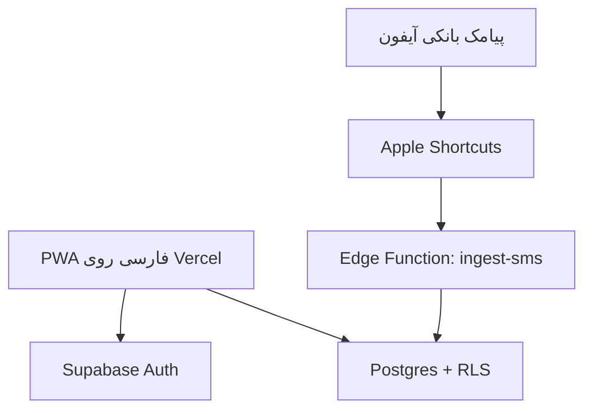

# دارایی‌بان

<p align="center">
  
</p>

<p align="center">
  
  
  
  
  
  
</p>

<p align="center">
  <a href="https://selfmali.vercel.app">نسخه زنده</a> ·
  <a href="#راه‌اندازی-محلی">راه‌اندازی</a> ·
  <a href="./docs/ARCHITECTURE.md">معماری</a> ·
  <a href="#اتصال-iphone-shortcuts">اتوماسیون آیفون</a> ·
  <a href="./SECURITY.md">امنیت</a>
</p>

یک وب‌اپلیکیشن مالی فارسی، چندکاربره و قابل نصب (PWA) برای ثبت و تحلیل تراکنش‌ها، بودجه، بدهی‌ها، طلب‌ها و دارایی‌ها. دارایی‌بان علاوه بر ثبت دستی، پیامک بانکی آیفون را از طریق Shortcuts دریافت و به تراکنش تبدیل می‌کند.

> رابط کاربری کاملاً راست‌چین است، مبالغ را به تومان نمایش می‌دهد و تاریخ‌ها را با تقویم شمسی نشان می‌دهد.

## امکانات اصلی

- ثبت‌نام و ورود با ایمیل/رمز و Google OAuth
- نگهداری نشست کاربر روی دستگاه و جداسازی داده‌ها با Row Level Security
- ثبت دستی تراکنش و دریافت خودکار پیامک بانکی از iPhone Shortcuts
- ویرایش تراکنش، برچسب‌گذاری، انتقال به سطل زباله، بازیابی و حذف دائمی
- بودجه‌بندی مبتنی بر برچسب تراکنش؛ برای نمونه بودجه «اسنپ» فقط تراکنش‌های دارای تگ `اسنپ` را محاسبه می‌کند
- تقویم مالی شمسی و گزارش روزانه
- ثبت بدهی، طلب، دارایی و هدف ترکیب دارایی
- حالت روشن و تاریک
- نصب به‌صورت PWA روی iOS و Android
- طراحی واکنش‌گرا برای موبایل و دسکتاپ

## معماری



- **Frontend:** Next.js 16، React 19، TypeScript و CSS اختصاصی
- **Backend:** Supabase Auth و Postgres
- **Automation:** Supabase Edge Function برای تحلیل پیامک بانکی
- **Hosting:** Vercel با استقرار خودکار شاخه `main`
- **PWA:** Web App Manifest، Service Worker و آیکن‌های نصب

شرح جزئی‌تر جریان داده، امنیت و اجزای پروژه در [مستند معماری](docs/ARCHITECTURE.md) آمده است.

## ساختار پروژه

```text
app/                         رابط کاربری، احراز هویت و منطق مالی
lib/supabase.ts              کلاینت Supabase و آدرس endpoint پیامک
public/                      manifest، service worker، آیکن‌ها و تصویر اشتراک‌گذاری
supabase/functions/ingest-sms تحلیل پیامک بانکی و ثبت امن تراکنش
supabase/migrations/         تاریخچه تغییرات دیتابیس و RLS
docs/                        مستندات معماری و راه‌اندازی
.github/workflows/ci.yml     بررسی خودکار lint و build
vercel.json                  تنظیمات استقرار Vercel
```

## راه‌اندازی محلی

پیش‌نیازها:

- Node.js نسخه 22 یا جدیدتر
- یک پروژه Supabase با migrationها و Edge Function این مخزن

سپس:

```bash
git clone https://github.com/arschia/darayiban.git
cd darayiban
npm ci
cp .env.example .env.local
npm run dev:vercel
```

مقادیر واقعی زیر را در `.env.local` قرار دهید:

```dotenv
NEXT_PUBLIC_SUPABASE_URL=https://YOUR_PROJECT.supabase.co
NEXT_PUBLIC_SUPABASE_PUBLISHABLE_KEY=sb_publishable_YOUR_KEY
NEXT_PUBLIC_SITE_URL=http://localhost:3000
```

`NEXT_PUBLIC_SUPABASE_PUBLISHABLE_KEY` کلید عمومی سمت مرورگر است. کلید `service_role` فقط داخل محیط امن Supabase Edge Functions قرار می‌گیرد و هرگز نباید در کد، GitHub یا متغیر `NEXT_PUBLIC_` ذخیره شود.

## فرمان‌های کاربردی

| فرمان | کاربرد |
|---|---|
| `npm run dev:vercel` | اجرای محلی با Next.js |
| `npm run build:vercel` | ساخت نسخه production برای Vercel |
| `npm run start:vercel` | اجرای build تولیدشده |
| `npm run lint` | بررسی کیفیت کد |
| `npm run typecheck` | بررسی کامل TypeScript |
| `npm test` | اجرای lint، typecheck و build کامل |
| `npm run dev` | اجرای نسخه سازگار با OpenAI Sites/Vinext |
| `npm run build` | ساخت نسخه OpenAI Sites/Vinext |

## اتصال iPhone Shortcuts

در اپ، از بخش «آموزش» یک توکن اختصاصی بسازید. سپس در Automation آیفون، رویداد دریافت پیام را انتخاب و اکشن **Get Contents of URL** را با مشخصات زیر تنظیم کنید:

```text
POST https://YOUR_PROJECT.supabase.co/functions/v1/ingest-sms
```

Header:

```text
x-selfmali-token: توکن اختصاصی حساب
```

JSON Body:

```json
{
  "message": "متن کامل پیامک",
  "device_time": "زمان دریافت پیام روی آیفون",
  "bank_name": "نام بانک (اختیاری)"
}
```

توکن هر کاربر به‌صورت هش‌شده در دیتابیس نگهداری می‌شود. Edge Function پیام‌های تکراری را با fingerprint تشخیص می‌دهد و پیام غیرمالی را وارد جدول تراکنش نمی‌کند.

## احراز هویت و Redirect URL

برای محیط production، در Supabase از مسیر **Authentication → URL Configuration** این موارد را تنظیم کنید:

- Site URL: دامنه اصلی Vercel
- Redirect URL: همان دامنه اصلی با `/**`
- برای previewهای Vercel در صورت نیاز: `https://*-YOUR-VERCEL-SLUG.vercel.app/**`
- برای توسعه محلی: `http://localhost:3000/**`

در Google OAuth فقط callback خود Supabase ثبت می‌شود:

```text
https://YOUR_PROJECT.supabase.co/auth/v1/callback
```

## امنیت

- تمام جدول‌های مالی در schema عمومی دارای RLS هستند.
- هر policy دسترسی را با شناسه کاربر محدود می‌کند.
- کاربران ناشناس به داده‌های مالی دسترسی ندارند.
- Edge Function برای عملیات سروری از `service_role` استفاده می‌کند؛ این کلید در frontend وجود ندارد.
- توکن Shortcut قابل لغو است و مقدار خام آن در دیتابیس ذخیره نمی‌شود.
- فایل‌های `.env*` در Git نادیده گرفته می‌شوند و فقط `.env.example` ثبت شده است.

برای گزارش امن آسیب‌پذیری و سیاست مدیریت اطلاعات حساس، [سند امنیت پروژه](SECURITY.md) را بخوانید.

## استقرار روی Vercel

پروژه برای Vercel آماده است. پس از اتصال این مخزن به Vercel، شاخه `main` نسخه production و Pull Requestها نسخه preview می‌سازند. سه متغیر بخش راه‌اندازی محلی باید در تنظیمات Environment Variables پروژه Vercel ثبت شوند.

## وضعیت پروژه

این مخزن نسخه عملیاتی دارایی‌بان را نگهداری می‌کند. قیمت زنده ارز، طلا و نقره هنوز به یک منبع قیمت قابل اتکا نیاز دارد و در نقشه راه بعدی پروژه قرار می‌گیرد.

---

ساخته‌شده برای مدیریت مالی شخصی فارسی با تمرکز بر موبایل، حریم خصوصی و اتوماسیون آیفون.
