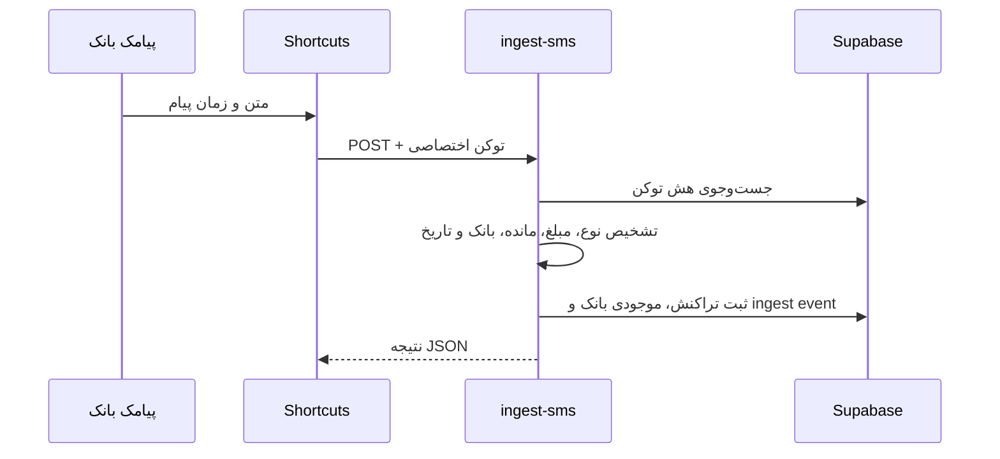

# معماری و جریان کاری دارایی‌بان

## هدف محصول

دارایی‌بان یک دفتر مالی شخصی چندکاربره است. هر کاربر حساب جدا دارد و فقط رکوردهای متعلق به خودش را می‌بیند. برنامه روی مرورگر اجرا می‌شود، به‌صورت PWA روی صفحه اصلی موبایل نصب می‌شود و می‌تواند تراکنش‌های بانکی را هم دستی و هم از پیامک آیفون دریافت کند.

## اجزای اصلی

| جزء | مسئولیت |
|---|---|
| Next.js App Router | صفحات، رابط فارسی، مدیریت نشست و تعامل با داده‌ها |
| Supabase Auth | ثبت‌نام ایمیلی، ورود با رمز، Google OAuth و نگهداری نشست |
| Supabase Postgres | تراکنش‌ها، بودجه‌ها، تعهدات، دارایی‌ها، موجودی بانک، تنظیمات اعلان و توکن‌های اتوماسیون |
| Row Level Security | محدود کردن هر query به مالک همان رکورد |
| Edge Function `ingest-sms` | اعتبارسنجی توکن، تحلیل پیامک، ثبت تراکنش و موجودی و هشدار سقف |
| Edge Function `send-daily-summary` | ساخت گزارش هزینه روز و ارسال Web Push |
| Supabase Cron + Vault | زمان‌بندی گزارش‌ها و نگهداری رمزگذاری‌شده کلیدهای VAPID |
| Vercel | میزبانی frontend، HTTPS، CDN و previewهای Git |
| Service Worker | فعال کردن قابلیت نصب PWA و پوسته اصلی برنامه |

## جریان ورود

1. برنامه نشست ذخیره‌شده Supabase را از مرورگر بازیابی می‌کند.
2. اگر نشست معتبر باشد داشبورد بدون ورود دوباره باز می‌شود.
3. ورود ایمیلی با `signInWithPassword` انجام می‌شود.
4. ورود گوگل با `signInWithOAuth` به Supabase می‌رود و سپس به origin برنامه برمی‌گردد.
5. کاربری که ابتدا با گوگل ثبت‌نام کرده می‌تواند داخل برنامه برای همان حساب رمز تعیین کند.

## جریان تراکنش دستی

1. کاربر نوع، مبلغ تومانی، توضیح، کارت، تاریخ شمسی، دسته و تگ‌ها را وارد می‌کند.
2. frontend مبلغ را برای ذخیره‌سازی سازگار به ریال تبدیل می‌کند.
3. Supabase درخواست را با JWT کاربر دریافت می‌کند.
4. policy جدول `transactions` فقط درج یا تغییر رکوردی با `user_id = auth.uid()` را می‌پذیرد.
5. در نمایش، مبلغ دوباره به تومان و زمان به تقویم شمسی تبدیل می‌شود.

## جریان پیامک آیفون

Edge Function این کنترل‌ها را انجام می‌دهد:

- تبدیل ارقام فارسی و عربی به لاتین
- تشخیص برداشت، خرید، واریز یا انتقال
- تشخیص مبلغ ریال/تومان و نرمال‌سازی به ریال
- تبدیل تاریخ شمسی موجود در پیامک به ISO
- استخراج راهنمای کارت مبدأ و مقصد
- ساخت fingerprint برای جلوگیری از ثبت دوباره همان پیام
- ثبت رخدادهای parsed، ignored و failed برای عیب‌یابی
- استخراج مانده و به‌روزرسانی آخرین موجودی بر پایه بانک و حساب
- بررسی مجموع برداشت‌های روز و ارسال هشدار پس از عبور از سقف

## جریان اعلان

اشتراک Push هر دستگاه با کلید عمومی VAPID در مرورگر ساخته و در جدول `push_subscriptions` ذخیره می‌شود. کلید خصوصی فقط داخل Supabase Vault قرار دارد. ثبت برداشت پیامکی سقف همان روز را بررسی می‌کند و Cron نیز هر پنج دقیقه زمان گزارش کاربران را کنترل می‌کند. جدول `notification_deliveries` با کلید یکتا مانع ارسال چندباره یک هشدار در همان روز می‌شود.

## برچسب و بودجه

بودجه به یک `tag` اختیاری متصل است. جمع مصرف بودجه فقط از تراکنش‌های برداشت فعال در بازه بودجه و دارای همان تگ محاسبه می‌شود. بنابراین تراکنش بدون تگ «اسنپ» وارد بودجه اسنپ نمی‌شود.

## حذف نرم و سطل زباله

حذف معمولی مقدار `deleted_at` را تنظیم می‌کند؛ رکورد باقی می‌ماند اما از گزارش‌ها و بودجه‌ها کنار گذاشته می‌شود. کاربر می‌تواند آن را بازیابی کند. حذف دائمی فقط برای رکوردی مجاز است که قبلاً به سطل زباله منتقل شده باشد.

## مدل امنیتی

- frontend فقط publishable key را دریافت می‌کند.
- کلید `service_role` فقط داخل Edge Function و محیط Supabase است.
- توکن Shortcut پس از ساخت فقط یک بار به کاربر نمایش داده و در دیتابیس به‌صورت SHA-256 ذخیره می‌شود.
- هر جدول کاربری policy مالکیت مستقل دارد.
- Edge Function شناسه کاربر را از توکن معتبر پیدا می‌کند و `user_id` را از body درخواست قبول نمی‌کند.

## متغیرهای محیطی

| نام | محیط | محرمانه؟ | کاربرد |
|---|---|---|---|
| `NEXT_PUBLIC_SUPABASE_URL` | Browser/Build | خیر | آدرس API پروژه Supabase |
| `NEXT_PUBLIC_SUPABASE_PUBLISHABLE_KEY` | Browser/Build | خیر | کلید عمومی frontend |
| `NEXT_PUBLIC_SITE_URL` | Build | خیر | دامنه اصلی برای metadata و redirect |
| `SUPABASE_SERVICE_ROLE_KEY` | Supabase Edge Function | بله | عملیات امن سمت سرور |

## استقرار

Vercel از `vercel.json` استفاده می‌کند، dependencies را با `npm ci` نصب و پروژه را با `npm run build:vercel` می‌سازد. با اتصال GitHub، هر push روی `main` یک deployment تولیدی و هر Pull Request یک preview می‌سازد.
