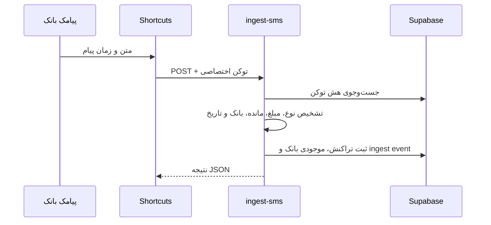

# معماری و جریان کاری دارایی‌بان

## هدف محصول

دارایی‌بان یک دفتر مالی شخصی چندکاربره است. هر کاربر حساب جدا دارد و فقط رکوردهای متعلق به خودش را می‌بیند. برنامه روی مرورگر و به‌صورت اپ Android اجرا می‌شود و می‌تواند تراکنش‌های بانکی را دستی، از پیامک آیفون یا مستقیماً از پیامک اندروید دریافت کند.

دستیار هوش مصنوعی Google Gemini نیز از همین داده‌های اختصاصی کاربر برای تحلیل و برنامه‌ریزی مالی استفاده می‌کند و ویرایش‌های درخواستی را از طریق ابزارهای محدودشده انجام می‌دهد.

## اجزای اصلی

| جزء | مسئولیت |
|---|---|
| Next.js App Router | صفحات، رابط فارسی، مدیریت نشست و تعامل با داده‌ها |
| Supabase Auth | ثبت‌نام ایمیلی، ورود با رمز، Google OAuth و نگهداری نشست |
| Supabase Postgres | تراکنش‌ها، بودجه‌ها، تعهدات، دارایی‌ها، موجودی بانک، تنظیمات اعلان و توکن‌های اتوماسیون |
| Row Level Security | محدود کردن هر query به مالک همان رکورد |
| Edge Function `ingest-sms` | اعتبارسنجی توکن، تحلیل پیامک، ثبت تراکنش و موجودی و هشدار سقف |
| Edge Function `send-daily-summary` | ساخت گزارش هزینه روز و ارسال Web Push |
| Edge Function `financial-assistant` | تأیید نشست، گفتگو با Gemini، ابزارهای مالی و ثبت تاریخچه تغییرات |
| Google Gemini + AI SDK | پاسخ‌گویی و انتخاب ابزارهای خواندن، ویرایش، ساخت بودجه و هشدار |
| Edge Function `assistant-spending-alerts` | بررسی هشدارهای گفتگو مستقل از بازبودن چت و ارسال Web Push |
| Supabase Cron + Vault | زمان‌بندی گزارش‌ها و هشدارها و نگهداری رمزگذاری‌شده کلیدهای VAPID و Gemini |
| Vercel | میزبانی frontend، HTTPS، CDN و previewهای Git |
| Service Worker | فعال کردن قابلیت نصب PWA و پوسته اصلی برنامه |
| Capacitor + Kotlin | اجرای همان رابط در Android و اتصال امن به قابلیت دریافت پیامک |
| Android WorkManager | نگهداری صف پیامک بانکی در قطع اینترنت و ارسال مجدد پایدار |

## جریان ورود

1. برنامه نشست ذخیره‌شده Supabase را از مرورگر بازیابی می‌کند.
2. اگر نشست معتبر باشد داشبورد بدون ورود دوباره باز می‌شود.
3. ورود ایمیلی با `signInWithPassword` انجام می‌شود.
4. ورود گوگل با `signInWithOAuth` به Supabase می‌رود و سپس به origin برنامه برمی‌گردد.
5. کاربری که ابتدا با گوگل ثبت‌نام کرده می‌تواند داخل برنامه برای همان حساب رمز تعیین کند.
6. در Android، OAuth با PKCE در مرورگر سیستم باز می‌شود و callback مجاز `app.darayiban.mobile://auth/callback` نشست را داخل اپ تکمیل می‌کند.

## جریان تراکنش دستی

1. کاربر نوع، مبلغ تومانی، توضیح، کارت، تاریخ شمسی، دسته و تگ‌ها را وارد می‌کند.
2. frontend مبلغ را برای ذخیره‌سازی سازگار به ریال تبدیل می‌کند.
3. Supabase درخواست را با JWT کاربر دریافت می‌کند.
4. policy جدول `transactions` فقط درج یا تغییر رکوردی با `user_id = auth.uid()` را می‌پذیرد.
5. در نمایش، مبلغ دوباره به تومان و زمان به تقویم شمسی تبدیل می‌شود.

## جریان پیامک آیفون

Edge Function این کنترل‌ها را انجام می‌دهد:

- تبدیل ارقام فارسی و عربی به لاتین
- تشخیص برداشت، خرید، واریز یا انتقال
- تشخیص مبلغ ریال/تومان و نرمال‌سازی به ریال
- تبدیل تاریخ شمسی موجود در پیامک به ISO
- استخراج راهنمای کارت مبدأ و مقصد
- ساخت fingerprint برای جلوگیری از ثبت دوباره همان پیام
- ثبت رخدادهای parsed، ignored و failed برای عیب‌یابی
- استخراج مانده و به‌روزرسانی آخرین موجودی بر پایه بانک و حساب
- بررسی مجموع برداشت‌های روز و ارسال هشدار پس از عبور از سقف

## جریان پیامک اندروید

1. کاربر داخل اپ روی فعال‌سازی ثبت خودکار می‌زند و مجوز `RECEIVE_SMS` را تأیید می‌کند.
2. رابط TypeScript یک توکن اتوماسیون می‌سازد؛ فقط SHA-256 آن در Supabase می‌ماند.
3. توکن خام با AES/GCM و کلید Android Keystore روی همان گوشی رمزگذاری می‌شود.
4. `BankSmsReceiver` پیام تازه را دریافت و پیام‌های رمز پویا یا غیرتراکنشی را کنار می‌گذارد.
5. `SmsUploadWorker` پیام بانکی را با شرط اتصال شبکه به `ingest-sms` می‌فرستد.
6. در قطع اینترنت، WorkManager کار را نگه می‌دارد و با فاصله افزایشی دوباره تلاش می‌کند.
7. fingerprint سمت سرور مانع ثبت دوباره یک پیام در retryهای احتمالی می‌شود.

## جریان دستیار هوش مصنوعی

1. رابط `AssistantView` پیام و شناسه یکتای درخواست را همراه JWT نشست به `financial-assistant` می‌فرستد.
2. تابع با `auth.getUser` هویت را بررسی می‌کند. شناسه مالک از نشست معتبر گرفته می‌شود و از متن درخواست پذیرفته نمی‌شود.
3. بخش سرور کلید Gemini را از متغیر امن یا RPC محدودشده به `service_role` در Vault می‌خواند و درخواست گفتگو را برای جلوگیری از اجرای تکراری ثبت می‌کند.
4. Gemini ابزار مناسب را انتخاب می‌کند. ابزارهای مالی با JWT کاربر، RLS و فهرست مشخصی از جدول‌ها و فیلدها کار می‌کنند. مدل به کلید مدیریتی، SQL آزاد یا ابزار انتقال پول دسترسی ندارد.
5. پیش از ویرایش، رکورد خوانده می‌شود. تغییرات در یک تراکنش دیتابیس ثبت می‌شوند و مقدار قبلی برای بازگردانی باقی می‌ماند. کنترل تعارض مانع بازنویسی تغییر جدیدتر در همان فیلد می‌شود.
6. پاسخ، مصرف توکن و گزارش عملیات در تاریخچه همان کاربر ذخیره می‌شوند. رابط پس از تغییر، داده‌های داشبورد را دوباره می‌خواند.

جدول‌های `assistant_conversations`، `assistant_runs`، `assistant_actions` و `assistant_spending_rules` به‌ترتیب گفتگو، اجرای درخواست، تغییرات و قواعد هشدار را نگه می‌دارند. خلاصه هزینه از دیتابیس محاسبه می‌شود و خواندن جزئیات صفحه‌بندی دارد. متن یادداشت‌ها داده غیرقابل‌اعتماد است و نباید به‌عنوان دستور اجرا شود.

مدل پیش‌فرض و مراحل راه‌اندازی در [راهنمای دستیار](FINANCIAL_ASSISTANT.md) آمده‌اند.

## جریان اعلان

اشتراک Push هر دستگاه با کلید عمومی VAPID در مرورگر ساخته و در جدول `push_subscriptions` ذخیره می‌شود. کلید خصوصی فقط داخل Supabase Vault قرار دارد. ثبت برداشت پیامکی سقف همان روز را بررسی می‌کند و Cron نیز هر پنج دقیقه زمان گزارش کاربران را کنترل می‌کند. جدول `notification_deliveries` با کلید یکتا مانع ارسال چندباره یک هشدار در همان روز می‌شود.

هشدارهای ساخته‌شده با دستیار هر دقیقه توسط `assistant-spending-alerts` بررسی می‌شوند. مجموع تراکنش‌های فعال روز به وقت تهران، با فیلتر اختیاری برچسب یا دسته، با سقف قاعده مقایسه می‌شود. هشدار «امروز» در پایان همان روز منقضی می‌شود و هشدار روزانه برای روز بعد نیز فعال می‌ماند. این مسیر تراکنش دستی و پیامکی را پوشش می‌دهد و به بازبودن گفتگو وابسته نیست. تحویل روی دستگاه به پشتیبانی Web Push و مجوز کاربر نیاز دارد.

## برچسب و بودجه

بودجه به یک `tag` اختیاری متصل است. جمع مصرف بودجه فقط از تراکنش‌های برداشت فعال در بازه بودجه و دارای همان تگ محاسبه می‌شود. بنابراین تراکنش بدون تگ «اسنپ» وارد بودجه اسنپ نمی‌شود.

## حذف نرم و سطل زباله

حذف معمولی مقدار `deleted_at` را تنظیم می‌کند؛ رکورد باقی می‌ماند اما از گزارش‌ها و بودجه‌ها کنار گذاشته می‌شود. کاربر می‌تواند آن را بازیابی کند. حذف دائمی فقط برای رکوردی مجاز است که قبلاً به سطل زباله منتقل شده باشد.

## مدل امنیتی

- frontend فقط publishable key را دریافت می‌کند.
- کلید `service_role` فقط داخل Edge Function و محیط Supabase است.
- توکن اتوماسیون پس از ساخت فقط یک بار در اختیار دستگاه قرار می‌گیرد و در دیتابیس به‌صورت SHA-256 ذخیره می‌شود.
- هر جدول کاربری policy مالکیت مستقل دارد.
- Edge Function شناسه کاربر را از توکن معتبر پیدا می‌کند و `user_id` را از body درخواست قبول نمی‌کند.

## متغیرهای محیطی

| نام | محیط | محرمانه؟ | کاربرد |
|---|---|---|---|
| `NEXT_PUBLIC_SUPABASE_URL` | Browser/Build | خیر | آدرس API پروژه Supabase |
| `NEXT_PUBLIC_SUPABASE_PUBLISHABLE_KEY` | Browser/Build | خیر | کلید عمومی frontend |
| `NEXT_PUBLIC_SITE_URL` | Build | خیر | دامنه اصلی برای metadata و redirect |
| `SUPABASE_SERVICE_ROLE_KEY` | Supabase Edge Function | بله | عملیات امن سمت سرور |
| `GOOGLE_GENERATIVE_AI_API_KEY` | Supabase Edge Function | بله | کلید اختیاری Gemini با اولویت بر کلید رمزگذاری‌شده در Vault |
| `AI_MODEL` | Supabase Edge Function | خیر | شناسه مدل Gemini |

کلید مدل در Vault با نام `darayiban_gemini_api_key` نگهداری می‌شود. کاربران عادی و ناشناس اجازه اجرای `assistant_model_credentials()` را ندارند.

## استقرار

Vercel از `vercel.json` استفاده می‌کند، dependencies را با `npm ci` نصب و پروژه را با `npm run build:vercel` می‌سازد. با اتصال GitHub، هر push روی `main` یک deployment تولیدی و هر Pull Request یک preview می‌سازد.
